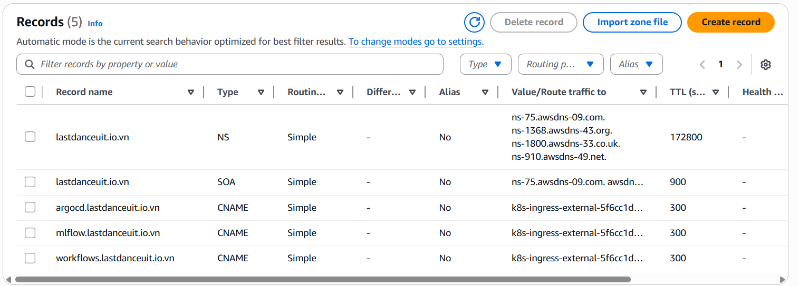

# Service Access Guide

## 1. Get ELB DNS

Run the following command to retrieve the Load Balancer DNS:

```bash
kubectl get ingress -n argocd argocd -o jsonpath='{.status.loadBalancer.ingress[0].hostname}'
```

## 2. Configure DNS Records

Go to **Route53 Hosted zones**, create CNAME records pointing to the ELB DNS for:
- `argocd.lastdanceuit.io.vn`
- `mlflow.lastdanceuit.io.vn`
- `workflows.lastdanceuit.io.vn`



## 3. Verify SSL Certificates

Check if the certificates are ready:

```bash
kubectl get certificate -A
```

Example output (certificates not ready):
```
NAMESPACE        NAME                           READY   SECRET                         AGE
argo-workflows   workflows-lastdanceuit-io-vn   False   workflows-lastdanceuit-io-vn   3m27s
argocd           argocd-lastdanceuit-io-vn      False   argocd-lastdanceuit-io-vn      3m29s
mlflow           mlflow-lastdanceuit-io-vn      False   mlflow-lastdanceuit-io-vn      3m28s
```

If certificates are not ready, restart CoreDNS:

```bash
kubectl rollout restart deployment coredns -n kube-system
```

**Wait a moment** and check again:

```bash
kubectl get certificate -A
```

Expected output (certificates ready):
```
NAMESPACE        NAME                           READY   SECRET                         AGE
argo-workflows   workflows-lastdanceuit-io-vn   True    workflows-lastdanceuit-io-vn   4m23s
argocd           argocd-lastdanceuit-io-vn      True    argocd-lastdanceuit-io-vn      4m25s
mlflow           mlflow-lastdanceuit-io-vn      True    mlflow-lastdanceuit-io-vn      4m24s
```

## 4. Further troubleshooting

```
kubectl delete challenge --all -n argocd
kubectl delete challenge --all -n mlflow
kubectl delete challenge --all -n argo-workflows
kubectl delete certificate --all -n argocd
kubectl delete certificate --all -n mlflow
kubectl delete certificate --all -n argo-workflows
```
